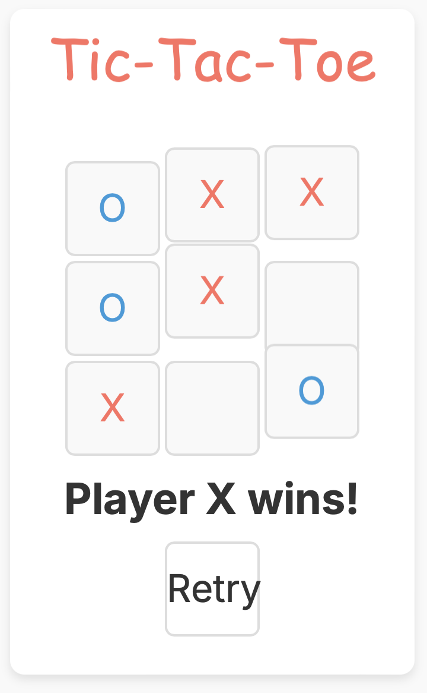

# Tic-Tac-Toe Game

This project is a simple Tic-Tac-Toe game built using Spring Boot for the backend, Next.js (with TypeScript and Tailwind CSS) for the frontend, and MongoDB for the database. Docker is used to containerize the services for easy deployment and development.



## Table of Contents

- [Prerequisites](#prerequisites)
- [Setup](#setup)
  - [Backend (Spring Boot)](#backend-spring-boot)
  - [Frontend (Next.js with TypeScript and Tailwind CSS)](#frontend-nextjs-with-typescript-and-tailwind-css)
  - [Database (MongoDB)](#database-mongodb)
- [Running the Application](#running-the-application)
- [API Endpoints](#api-endpoints)
- [Docker Setup](#docker-setup)
- [Contributing](#contributing)
- [License](#license)

## Prerequisites

- Docker and Docker Compose
- Java 21 or later
- Node.js and npm
- MongoDB (if running locally without Docker)

## Setup

### Backend (Spring Boot)

1. Navigate to the backend directory:

    ```bash
    cd backend-tictactoe
    ```

2. Build the Spring Boot application:

    ```bash
    ./mvnw clean package
    ```

### Frontend (Next.js with TypeScript and Tailwind CSS)

1. Install Node.js and npm (if not already installed):

    - macOS: `brew install node`
    - Linux: `curl -fsSL https://deb.nodesource.com/setup_16.x | sudo -E bash - && sudo apt-get install -y nodejs`
    - Windows: Download from [Node.js](https://nodejs.org/)

2. Create the Next.js application with TypeScript:

    ```bash
    cd frontend-tictactoe
    npx create-next-app@latest --typescript .
    ```

3. Install Tailwind CSS and its dependencies:

    ```bash
    npm install tailwindcss postcss autoprefixer
    ```

4. Initialize Tailwind CSS:

    ```bash
    npx tailwindcss init -p
    ```

5. Configure Tailwind in `tailwind.config.js`:

    ```js
    /** @type {import('tailwindcss').Config} */
    module.exports = {
      content: [
        "./pages/**/*.{js,ts,jsx,tsx}",
        "./components/**/*.{js,ts,jsx,tsx}",
      ],
      theme: {
        extend: {},
      },
      plugins: [],
    }
    ```

6. Add Tailwind directives to your CSS:

    Create a `styles/globals.css` file if it doesn't already exist, and include the Tailwind CSS directives.

    ```css
    @tailwind base;
    @tailwind components;
    @tailwind utilities;
    ```

7. Import the CSS file in `pages/_app.tsx`:

    ```tsx
    import '../styles/globals.css'
    import type { AppProps } from 'next/app'

    function MyApp({ Component, pageProps }: AppProps) {
      return <Component {...pageProps} />
    }

    export default MyApp
    ```

### Database (MongoDB)

Ensure MongoDB is running locally or via Docker. The default configuration connects to `mongodb://localhost:27017/tictactoe`.

## Running the Application

### Using Docker Compose

1. Ensure Docker and Docker Compose are installed.
2. Navigate to the project root directory.
3. Run the following command:

    ```bash
    docker-compose up --build
    ```

This will start the MongoDB, Spring Boot backend, and Next.js frontend services.

### Without Docker

If you prefer to run the services individually without Docker, follow these steps:

#### Start MongoDB

Ensure MongoDB is running on `localhost:27017`.

#### Start Backend

1. Navigate to the backend directory:

    ```bash
    cd backend-tictactoe
    ```

2. Run the Spring Boot application:

    ```bash
    ./mvnw spring-boot:run
    ```

#### Start Frontend

1. Navigate to the frontend directory:

    ```bash
    cd frontend-tictactoe
    ```

2. Start the Next.js application:

    ```bash
    npm run dev
    ```

## API Endpoints

- **Create a new game**

  ```http
  POST /api/games
